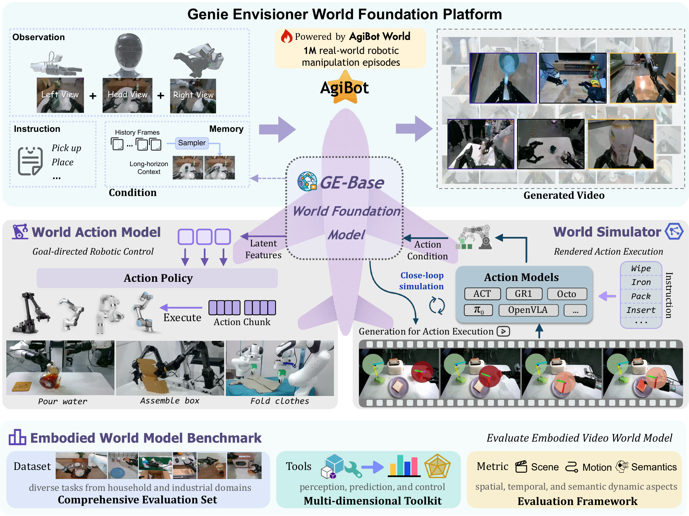

# Genie Envisioner: A Unified World Foundation Platform for Robotic Manipulation

  &nbsp;  &nbsp;

This repo is the official implementation of Genie Envisioner: A Unified World Foundation Platform for Robotic Manipulation.

## News

- [2025.08.08] 📄 The technical report [Genie Envisioner: A Unified World Foundation Platform for Robotic Manipulation](https://arxiv.org/abs/2508.05635) has been released.

- [2025.05.16] 🚀 [EWMB (Embodied World Model Benchmark)](https://github.com/AgibotTech/EWMBench) has been released.

## TODO
- [] Release inference & training code
- [] Release model weights
- [] Support more backbone models

## License
All the data and code within this repo are under [CC BY-NC-SA 4.0](https://creativecommons.org/licenses/by-nc-sa/4.0/).
